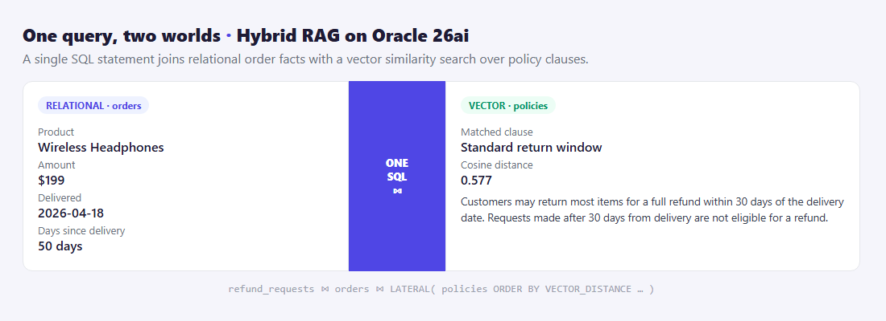
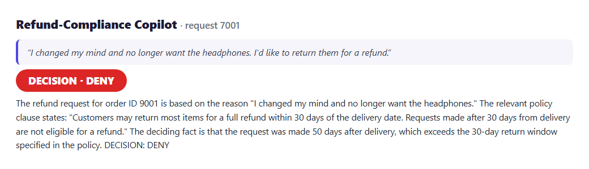

# One Query, Two Worlds: Hybrid RAG on Oracle 26ai

*Answering a question that needs both your documents and your tables — in a single SQL statement, no bolt-on vector database.*

---

Most "AI + database" demos keep two stores: a vector database for the unstructured stuff and your real database for the facts — with glue code stitching them together at query time. Oracle 26ai lets me delete that whole layer. Vectors and tables live in **one database**, so a single query can search by *meaning* and join to *facts* at the same time.

To show it, I built a small **refund-compliance copilot**.

## The problem: a decision that needs both halves

A customer asks for a refund. To answer fairly you need two very different things:

- 🧠 **Meaning** — which refund *policy clause* applies to what they said? ("I changed my mind" vs "it arrived broken" land on different rules.) That's a **vector search**.
- 📊 **Facts** — how many days since delivery? was it final sale? That's plain **relational** data.

Get either half wrong and the decision is wrong.

## The trick: one hybrid SQL

The copilot embeds the customer's reason, then runs a single statement that joins the order row to the *nearest policy clauses* via `VECTOR_DISTANCE` inside a `CROSS JOIN LATERAL`:


*Left: the order facts (relational). Right: the policy clause matched by meaning (vector). One statement returns both.*

```sql
SELECT o.product, o.amount,
       TRUNC(SYSDATE - o.delivered_date) AS days_since_delivery,
       p.title, p.clause_text,
       VECTOR_DISTANCE(p.embedding, :reason_vec, COSINE) AS policy_distance
FROM   refund_requests r
JOIN   orders o ON o.order_id = r.order_id
CROSS JOIN LATERAL (
   SELECT title, clause_text, embedding
   FROM   policies
   ORDER BY VECTOR_DISTANCE(embedding, :reason_vec, COSINE)
   FETCH FIRST 2 ROWS ONLY
) p
WHERE  r.request_id = :rid;
```

## The decision

With both halves in hand, the copilot reasons strictly from the retrieved clause and the order facts, then commits to a verdict — quoting the clause and the deciding fact:


*"Changed my mind", 50 days after delivery → DENY, citing the 30-day window. Every claim traces to a real row.*

## Why this matters

- **One source of truth.** No syncing a separate vector store with your transactional data — same database, same transaction, same backup.
- **Grounded answers.** The model never guesses the policy or the dates; both come straight from SQL, so the decision is explainable and auditable.
- **It's just SQL.** `VECTOR_DISTANCE` sits in the same `SELECT` as your joins and filters — your existing skills apply.

The agent reaches the database through the **SQLcl MCP Server** (`sql -mcp`), so it queries safely with a saved connection and every statement is audited.

## The takeaway

"Hybrid search" usually means running two systems and merging results in your app. On Oracle 26ai it means writing one query. For any decision that blends *what was said* with *what is true* — refunds, claims, compliance, support — that's a genuinely simpler architecture.

📦 **Full code on GitHub:** [github.com/khadayatepa/hybrid-rag-copilot](https://github.com/khadayatepa/hybrid-rag-copilot)

---

*About the author: **Prashant Khadayate** is an **Oracle ACE** focused on the Oracle AI Database (26ai), AI Vector Search, and the SQLcl MCP Server. Connect on [LinkedIn](https://www.linkedin.com/in/prashant-khadayate-1a8b0b97/) for more hands-on Oracle AI experiments.*

> A learning demo — not legal or financial advice.
